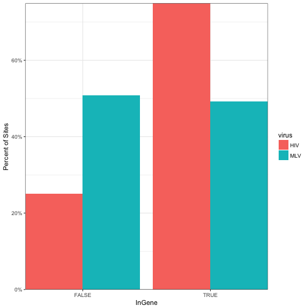
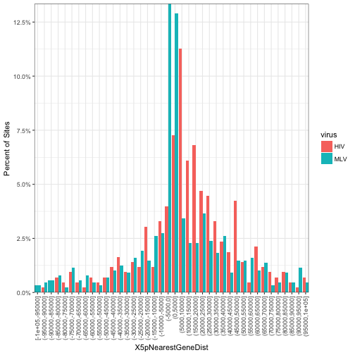

%\VignetteEngine{knitr::knitr}
%\VignetteIndexEntry{Using hiAnnotator}

## Introduction
`hiAnnotator` contains set of functions which allow users to annotate a GRanges object with custom set of annotations. The basic philosophy of this package is to take two GRanges objects (query & subject) with common set of space/seqnames (i.e. chromosomes) and return associated annotation per space/seqname and rows from the query matching space/seqnames and rows from the subject (i.e. genes or cpg islands).

This package comes with three types of annotation functions which calculates if a position from query is: within a feature, near a feature, or count features in defined window sizes. Moreover, each function is equipped with parallel backend to utilize the `foreach` package. The package is also equipped with wrapper functions, which finds appropriate columns needed to make a GRanges object from a common data frame.

The work horse functions performing most of the calculations are from `GenomicRanges` package which comes from the Bioconductor repository. Most of the functions in the `hiAnnotator` package are wrapper around following functions: `nearest()`, and `findOverlaps()`.

Below are few simple steps to get you started.

## Quick *hiAnnotator* tutorial.

### Step 1: Loading the tools
First load this package and the parallel backend of choice. See loading parallel backend section at the bottom of the page for more choices.

```r
library(hiAnnotator)
```

### Step 2: Loading & formatting the data
The package comes with example dataframes: `sites` and `genes`. In the rest of this tutorial we will use sites as query and genes as subject. Using the `makeGRanges()` function supplied with the package, one can easily go from a dataframe to a GRanges  object without too much hassle.


```r
data(sites)
## sites object doesn't have a start & stop column to denote genomic range, hence soloStart parameter must be TRUE or a nasty error will be thrown!
alldata.rd <- makeGRanges(sites, soloStart = TRUE, freeze = "hg18") 

data(genes)
## adding freeze populates SeqInfo slot of GRanges object.
genes.rd <- makeGRanges(genes, freeze = "hg18") 
```

```
## Warning in valid.GenomicRanges.seqinfo(x, suggest.trim = TRUE): GRanges object contains 1 out-of-bound range located on sequence
##   chr6_cox_hap1. Note that ranges located on a sequence whose length is
##   unknown (NA) or on a circular sequence are not considered out-of-bound
##   (use seqlengths() and isCircular() to get the lengths and circularity
##   flags of the underlying sequences). You can use trim() to trim these
##   ranges. See ?`trim,GenomicRanges-method` for more information.
```

The package also comes with wrapper functions to download annotation tracks off of UCSC genome browser using `rtracklayer` package.


```r
refflat <- getUCSCtable("refFlat", "RefSeq Genes") 
genes <- makeGRanges(refflat)
```

### Step 3: Annotating the data
With the data loaded and formatted, next series of functions highlight various ways they can be annotated. One thing to keep in mind is that, only the `intersect` of spaces/chromosomes/seqnames between query & subject will be annotated, rest will be ignored and will have NAs in the output. 

#### getNearestFeature: find the nearest neighbor
Given a query object, the function retrieves the nearest feature and its properties from a subject and then appends them as new columns within the query object. When used in genomic context, the function can be used to retrieve a nearest gene 5' or 3' end relative to a genomic position of interest. By default, nearest distance to either boundary is calculated unless specifically defined using the `side` parameter.


```r
nearestGenes <- getNearestFeature(alldata.rd, genes.rd, "NearestGene")
```

```
## 
## Attaching package: 'dplyr'
```

```
## The following objects are masked from 'package:hiAnnotator':
## 
##     intersect, setdiff, union
```

```
## The following objects are masked from 'package:GenomicRanges':
## 
##     intersect, setdiff, union
```

```
## The following object is masked from 'package:GenomeInfoDb':
## 
##     intersect
```

```
## The following objects are masked from 'package:IRanges':
## 
##     collapse, desc, intersect, setdiff, slice, union
```

```
## The following objects are masked from 'package:S4Vectors':
## 
##     first, intersect, rename, setdiff, setequal, union
```

```
## The following objects are masked from 'package:BiocGenerics':
## 
##     combine, intersect, setdiff, union
```

```
## The following objects are masked from 'package:stats':
## 
##     filter, lag
```

```
## The following objects are masked from 'package:base':
## 
##     intersect, setdiff, setequal, union
```

```r
head(nearestGenes)
```

```
## GRanges object with 6 ranges and 8 metadata columns:
##       seqnames    ranges strand |               Sequence  Position         Chr
##          <Rle> <IRanges>  <Rle> |            <character> <numeric> <character>
##   [1]     chr1    773398      + | Burgess-HIV-HeLa-03e07    773398        chr1
##   [2]     chr1   1636200      - | Burgess-HIV-HeLa-10d11   1636200        chr1
##   [3]     chr1   2503557      - | Burgess-HIV-HeLa-04h05   2503557        chr1
##   [4]     chr1   3409787      + | Burgess-MLV-HeLa-nj1..   3409787        chr1
##   [5]     chr1   3420249      - | Burgess-MLV-HeLa-nj1..   3420249        chr1
##   [6]     chr1   8103835      + | Burgess-MLV-HeLa-oi0..   8103835        chr1
##               Ort       virus NearestGeneDist NearestGene NearestGeneOrt
##       <character> <character>       <integer> <character>    <character>
##   [1]           +         HIV           -6205   LOC643837              +
##   [2]           -         HIV            9435      CDK11B              -
##   [3]           -         HIV           -4551     C1orf93              +
##   [4]           +         MLV          -15422       MEGF6              -
##   [5]           -         MLV          -25884       MEGF6              -
##   [6]           +         MLV          -94855      ERRFI1              -
##   -------
##   seqinfo: 27 sequences from an unspecified genome
```

```r
# nearestGenes <- getNearestFeature(alldata.rd,genes.rd,"NearestGene", parallel=TRUE)

## get nearest 5' genes
nearestGenes <- getNearestFeature(alldata.rd, genes.rd, "NearestGene", side = "5p") 
head(nearestGenes)
```

```
## GRanges object with 6 ranges and 8 metadata columns:
##       seqnames    ranges strand |               Sequence  Position         Chr
##          <Rle> <IRanges>  <Rle> |            <character> <numeric> <character>
##   [1]     chr1    773398      + | Burgess-HIV-HeLa-03e07    773398        chr1
##   [2]     chr1   1636200      - | Burgess-HIV-HeLa-10d11   1636200        chr1
##   [3]     chr1   2503557      - | Burgess-HIV-HeLa-04h05   2503557        chr1
##   [4]     chr1   3409787      + | Burgess-MLV-HeLa-nj1..   3409787        chr1
##   [5]     chr1   3420249      - | Burgess-MLV-HeLa-nj1..   3420249        chr1
##   [6]     chr1   8103835      + | Burgess-MLV-HeLa-oi0..   8103835        chr1
##               Ort       virus X5pNearestGeneDist X5pNearestGene
##       <character> <character>          <integer>    <character>
##   [1]           +         HIV              20472      LOC643837
##   [2]           -         HIV               9435         CDK11B
##   [3]           -         HIV              -4551        C1orf93
##   [4]           +         MLV              48781       ARHGEF16
##   [5]           -         MLV              46965        MIR551A
##   [6]           +         MLV             -94855         ERRFI1
##       X5pNearestGeneOrt
##             <character>
##   [1]                 +
##   [2]                 -
##   [3]                 +
##   [4]                 +
##   [5]                 -
##   [6]                 -
##   -------
##   seqinfo: 27 sequences from an unspecified genome
```

```r
## get nearest 3' genes
nearestGenes <- getNearestFeature(alldata.rd, genes.rd, "NearestGene", side = "3p")
head(nearestGenes)
```

```
## GRanges object with 6 ranges and 8 metadata columns:
##       seqnames    ranges strand |               Sequence  Position         Chr
##          <Rle> <IRanges>  <Rle> |            <character> <numeric> <character>
##   [1]     chr1    773398      + | Burgess-HIV-HeLa-03e07    773398        chr1
##   [2]     chr1   1636200      - | Burgess-HIV-HeLa-10d11   1636200        chr1
##   [3]     chr1   2503557      - | Burgess-HIV-HeLa-04h05   2503557        chr1
##   [4]     chr1   3409787      + | Burgess-MLV-HeLa-nj1..   3409787        chr1
##   [5]     chr1   3420249      - | Burgess-MLV-HeLa-nj1..   3420249        chr1
##   [6]     chr1   8103835      + | Burgess-MLV-HeLa-oi0..   8103835        chr1
##               Ort       virus X3pNearestGeneDist X3pNearestGene
##       <character> <character>          <integer>    <character>
##   [1]           +         HIV              -6205      LOC643837
##   [2]           -         HIV             -12171         CDK11A
##   [3]           -         HIV               8383          MMEL1
##   [4]           +         MLV             -15422          MEGF6
##   [5]           -         MLV             -25884          MEGF6
##   [6]           +         MLV            -109469         ERRFI1
##       X3pNearestGeneOrt
##             <character>
##   [1]                 +
##   [2]                 -
##   [3]                 -
##   [4]                 -
##   [5]                 -
##   [6]                 -
##   -------
##   seqinfo: 27 sequences from an unspecified genome
```

```r
## get midpoint of genes
nearestGenes <- getNearestFeature(alldata.rd, genes.rd, "NearestGene", side = "midpoint")
head(nearestGenes)
```

```
## GRanges object with 6 ranges and 8 metadata columns:
##       seqnames    ranges strand |               Sequence  Position         Chr
##          <Rle> <IRanges>  <Rle> |            <character> <numeric> <character>
##   [1]     chr1    773398      + | Burgess-HIV-HeLa-03e07    773398        chr1
##   [2]     chr1   1636200      - | Burgess-HIV-HeLa-10d11   1636200        chr1
##   [3]     chr1   2503557      - | Burgess-HIV-HeLa-04h05   2503557        chr1
##   [4]     chr1   3409787      + | Burgess-MLV-HeLa-nj1..   3409787        chr1
##   [5]     chr1   3420249      - | Burgess-MLV-HeLa-nj1..   3420249        chr1
##   [6]     chr1   8103835      + | Burgess-MLV-HeLa-oi0..   8103835        chr1
##               Ort       virus midpointNearestGeneDist midpointNearestGene
##       <character> <character>               <integer>         <character>
##   [1]           +         HIV                    7134           LOC643837
##   [2]           -         HIV                   -1360              CDK11A
##   [3]           -         HIV                   -6878             C1orf93
##   [4]           +         MLV                   35516            ARHGEF16
##   [5]           -         MLV                   35893               MEGF6
##   [6]           +         MLV                 -102162              ERRFI1
##       midpointNearestGeneOrt
##                  <character>
##   [1]                      +
##   [2]                      -
##   [3]                      +
##   [4]                      +
##   [5]                      -
##   [6]                      -
##   -------
##   seqinfo: 27 sequences from an unspecified genome
```

```r
### get two nearest upstream and downstream genes relative the query
nearestTwoGenes <- get2NearestFeature(alldata.rd, genes.rd, "NearestGene")
```

```
## u = upstream, d = downstream
```

```
## thinking concept: u2.....u1.....intSite(+).....d1.....d2
```

```
## thinking concept: d2.....d1.....intSite(-).....u1.....u2
```

```
## u1
```

```
## u2
```

```
## d1
```

```
## d2
```

```r
head(nearestTwoGenes)
```

```
## GRanges object with 6 ranges and 17 metadata columns:
##       seqnames    ranges strand |               Sequence  Position         Chr
##          <Rle> <IRanges>  <Rle> |            <character> <numeric> <character>
##   [1]     chr1    773398      + | Burgess-HIV-HeLa-03e07    773398        chr1
##   [2]     chr1   1636200      - | Burgess-HIV-HeLa-10d11   1636200        chr1
##   [3]     chr1   2503557      - | Burgess-HIV-HeLa-04h05   2503557        chr1
##   [4]     chr1   3409787      + | Burgess-MLV-HeLa-nj1..   3409787        chr1
##   [5]     chr1   3420249      - | Burgess-MLV-HeLa-nj1..   3420249        chr1
##   [6]     chr1   8103835      + | Burgess-MLV-HeLa-oi0..   8103835        chr1
##               Ort       virus Either.NearestGene.upStream1.Dist
##       <character> <character>                         <integer>
##   [1]           +         HIV                             -6205
##   [2]           -         HIV                              9435
##   [3]           -         HIV                             -4551
##   [4]           +         MLV                            -15422
##   [5]           -         MLV                            -25884
##   [6]           +         MLV                            -94855
##       Either.NearestGene.upStream1 Either.NearestGene.upStream1.Ort
##                        <character>                      <character>
##   [1]                    LOC643837                                +
##   [2]                       CDK11B                                -
##   [3]                      C1orf93                                +
##   [4]                        MEGF6                                -
##   [5]                        MEGF6                                -
##   [6]                       ERRFI1                                -
##       Either.NearestGene.upStream2.Dist Either.NearestGene.upStream2
##                               <integer>                  <character>
##   [1]                            414938                        OR4F3
##   [2]                              9435                       CDK11B
##   [3]                           -424348                       ACTRT2
##   [4]                           -435638                     FLJ42875
##   [5]                             46872                      MIR551A
##   [6]                           -180361                      TNFRSF9
##       Either.NearestGene.upStream2.Ort Either.NearestGene.downStream1.Dist
##                            <character>                           <integer>
##   [1]                                +                              -77585
##   [2]                                -                                9435
##   [3]                                +                               76733
##   [4]                                -                               57334
##   [5]                                -                             -446100
##   [6]                                -                              231215
##       Either.NearestGene.downStream1 Either.NearestGene.downStream1.Ort
##                          <character>                        <character>
##   [1]                         SAMD11                                  +
##   [2]                         CDK11B                                  -
##   [3]                          PLCH2                                  +
##   [4]                        MIR551A                                  -
##   [5]                       FLJ42875                                  -
##   [6]                           RERE                                  -
##       Either.NearestGene.downStream2.Dist Either.NearestGene.downStream2
##                                 <integer>                    <character>
##   [1]                             -112431                         KLHL17
##   [2]                                9435                         CDK11B
##   [3]                              176816                           RER1
##   [4]                              127404                           WDR8
##   [5]                             -446100                       FLJ42875
##   [6]                              231215                           RERE
##       Either.NearestGene.downStream2.Ort
##                              <character>
##   [1]                                  +
##   [2]                                  -
##   [3]                                  +
##   [4]                                  -
##   [5]                                  -
##   [6]                                  -
##   -------
##   seqinfo: 27 sequences from an unspecified genome
```

#### getFeatureCounts: find out how many features are in a neighborhood
Given a query object and window size(s), the function finds all the rows in subject which are <= window size/2 distance away. If weights are assigned to each positions in the subject, then tallied counts are multiplied accordingly. If annotation object is large, spanning greater than 100 million rows, then `getFeatureCountsBig()` is used which uses midpoint and drops any weights column if specified to get the job done. The time complexity of this function can be found in `?findOverlaps`.


```r
geneCounts <- getFeatureCounts(alldata.rd, genes.rd, "NumOfGene")
head(geneCounts)
```

```
## GRanges object with 6 ranges and 8 metadata columns:
##       seqnames    ranges strand |               Sequence  Position         Chr
##          <Rle> <IRanges>  <Rle> |            <character> <numeric> <character>
##   [1]     chr1    773398      + | Burgess-HIV-HeLa-03e07    773398        chr1
##   [2]     chr1   1636200      - | Burgess-HIV-HeLa-10d11   1636200        chr1
##   [3]     chr1   2503557      - | Burgess-HIV-HeLa-04h05   2503557        chr1
##   [4]     chr1   3409787      + | Burgess-MLV-HeLa-nj1..   3409787        chr1
##   [5]     chr1   3420249      - | Burgess-MLV-HeLa-nj1..   3420249        chr1
##   [6]     chr1   8103835      + | Burgess-MLV-HeLa-oi0..   8103835        chr1
##               Ort       virus NumOfGene.1Kb NumOfGene.10Kb NumOfGene.1Mb
##       <character> <character>     <integer>      <integer>     <integer>
##   [1]           +         HIV             1              1            52
##   [2]           -         HIV             8              8            71
##   [3]           -         HIV             0              1            24
##   [4]           +         MLV             1              1            22
##   [5]           -         MLV             1              1            22
##   [6]           +         MLV             0              0            13
##   -------
##   seqinfo: 27 sequences from an unspecified genome
```

```r
# geneCounts <- getFeatureCounts(alldata.rd, genes.rd, "NumOfGene", parallel=TRUE)
```

If dealing with really large set of input objects, the function can break up the data using the `chunkSize` parameter. This is handy when trying to annotated ChipSeq data on an average laptop/machine. There is also `getFeatureCountsBig()` function which uses an alternative method to get the counts using `findInterval`.


```r
geneCounts <- getFeatureCounts(alldata.rd, genes.rd, "NumOfGene",
                               doInChunks = TRUE, chunkSize = 100)
head(geneCounts)

geneCounts <- getFeatureCountsBig(alldata.rd, genes.rd, "NumOfGene")
head(geneCounts)
```

#### getSitesInFeature: find out a position within a feature
When used in genomic context, the function annotates genomic positions of interest with information like if they were in a gene or cpg island or whatever annotation that was supplied in the subject.


```r
## Shows which feature(s) a position was found in.
InGenes <- getSitesInFeature(alldata.rd, genes.rd, "InGene")
head(InGenes)
```

```
## GRanges object with 6 ranges and 7 metadata columns:
##       seqnames    ranges strand |               Sequence  Position         Chr
##          <Rle> <IRanges>  <Rle> |            <character> <numeric> <character>
##   [1]     chr1    773398      + | Burgess-HIV-HeLa-03e07    773398        chr1
##   [2]     chr1   1636200      - | Burgess-HIV-HeLa-10d11   1636200        chr1
##   [3]     chr1   2503557      - | Burgess-HIV-HeLa-04h05   2503557        chr1
##   [4]     chr1   3409787      + | Burgess-MLV-HeLa-nj1..   3409787        chr1
##   [5]     chr1   3420249      - | Burgess-MLV-HeLa-nj1..   3420249        chr1
##   [6]     chr1   8103835      + | Burgess-MLV-HeLa-oi0..   8103835        chr1
##               Ort       virus        InGene   InGeneOrt
##       <character> <character>   <character> <character>
##   [1]           +         HIV     LOC643837           +
##   [2]           -         HIV CDK11B,CDK11A           -
##   [3]           -         HIV         FALSE        <NA>
##   [4]           +         MLV         MEGF6           -
##   [5]           -         MLV         MEGF6           -
##   [6]           +         MLV         FALSE        <NA>
##   -------
##   seqinfo: 27 sequences from an unspecified genome
```

```r
## Simply shows TRUE/FALSE 
InGenes <- getSitesInFeature(alldata.rd, genes.rd, "InGene", asBool = TRUE)
head(InGenes)
```

```
## GRanges object with 6 ranges and 6 metadata columns:
##       seqnames    ranges strand |               Sequence  Position         Chr
##          <Rle> <IRanges>  <Rle> |            <character> <numeric> <character>
##   [1]     chr1    773398      + | Burgess-HIV-HeLa-03e07    773398        chr1
##   [2]     chr1   1636200      - | Burgess-HIV-HeLa-10d11   1636200        chr1
##   [3]     chr1   2503557      - | Burgess-HIV-HeLa-04h05   2503557        chr1
##   [4]     chr1   3409787      + | Burgess-MLV-HeLa-nj1..   3409787        chr1
##   [5]     chr1   3420249      - | Burgess-MLV-HeLa-nj1..   3420249        chr1
##   [6]     chr1   8103835      + | Burgess-MLV-HeLa-oi0..   8103835        chr1
##               Ort       virus    InGene
##       <character> <character> <logical>
##   [1]           +         HIV      TRUE
##   [2]           -         HIV      TRUE
##   [3]           -         HIV     FALSE
##   [4]           +         MLV      TRUE
##   [5]           -         MLV      TRUE
##   [6]           +         MLV     FALSE
##   -------
##   seqinfo: 27 sequences from an unspecified genome
```

```r
# InGenes <- getSitesInFeature(alldata.rd, genes.rd, "InGene", asBool=TRUE, parallel=TRUE)
```

#### doAnnotation
This is a wrapper function which calls one of the functions shown above depending on annotType parameter: within, nearest, twoNearest, counts, countsBig. You can also pass any function to call on the resulting object for any post processing steps.


```r
doAnnotation(annotType = "within", alldata.rd, genes.rd, "InGene")
doAnnotation(annotType = "counts", alldata.rd, genes.rd, "NumOfGene")
doAnnotation(annotType = "countsBig", alldata.rd, genes.rd, "ChipSeqCounts")    
doAnnotation(annotType = "nearest", alldata.rd, genes.rd, "NearestGene")    
doAnnotation(annotType = "twoNearest", alldata.rd, genes.rd, "TwoNearestGenes")
geneCheck <- function(x, wanted) { x$isWantedGene <- x$InGene %in% wanted; 
                                   return(x) }
doAnnotation(annotType = "within", alldata.rd, genes.rd, "InGene",
             postProcessFun = geneCheck,
             postProcessFunArgs = list("wanted" = c("FOXJ3", "SEPT9", "RPTOR")) )
```

### Plotting Results
`hiAnnotator` comes with a handy plotting function `plotdisFeature` which summarizes and plots the distribution of newly annotated data. Function can be used to easily visualize things like distribution of integration sites around gene TSS, density of genes within various window sizes, etc.


```r
res <- doAnnotation(annotType = "within", alldata.rd, genes.rd, "InGene", asBool = TRUE)
plotdisFeature(res, "virus", "InGene")
```

```
## performing boolean summary
```



```r
res <- doAnnotation(annotType = "nearest", alldata.rd, genes.rd, "NearestGene", side = '5p')
plotdisFeature(res, "virus", "X5pNearestGeneDist")
```



```r
data(sites.ctrl)
sites$type <- "expr"
sites <- rbind(sites,sites.ctrl)
alldata.rd <- makeGRanges(sites, soloStart = TRUE)
res <- doAnnotation(annotType = "within", alldata.rd, genes.rd, "InGene", asBool = TRUE)
plotdisFeature(res, "virus", "InGene")
```

```
## performing boolean summary
```


```r
plotdisFeature(res, "virus", "InGene", typeRatio = TRUE)
```

```
## performing boolean summary
```


## Ways to load parallel backends
1) Load one of the following libraries depending on machine/OS: `doMC`, `doSMP`, `doSNOW`, `doMPI`     

2) Register the parallel backend using `registerDoXXXX()` function depending on the library. See the examples below:  


```r
## Example 1: library(doSMP)
w <- startWorkers(2)
registerDoSMP(w)
getNearestFeature(..., parallel = TRUE)

## Example 2: library(doMC)
registerDoMC(2)
getNearestFeature(..., parallel = TRUE)

## Example 3: library(doSNOW)
cl <- makeCluster(2, type = "SOCK")
registerDoSNOW(cl)
getNearestFeature(..., parallel = TRUE)

## Example 4: library(doParallel)
cl <- makeCluster(2)
registerDoParallel(cl)
getNearestFeature(..., parallel = TRUE)   
```

3) Few backends launch worker processes in the background, so be sure to close them. Read the documentation of respective `do*` package to get more information. Few examples are shown below.

For doSMP library, use `stopWorkers(w)`
For doSNOW & doParallel library, use `stopCluster(cl)`
