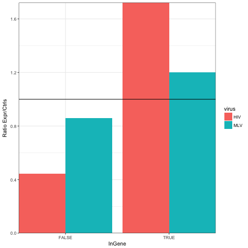

%\VignetteEngine{knitr::knitr}
%\VignetteIndexEntry{Using hiAnnotator}

## Introduction
`hiAnnotator` contains set of functions which allow users to annotate a GRanges object with custom set of annotations. The basic philosophy of this package is to take two GRanges objects (query & subject) with common set of space/seqnames (i.e. chromosomes) and return associated annotation per space/seqname and rows from the query matching space/seqnames and rows from the subject (i.e. genes or cpg islands).

This package comes with three types of annotation functions which calculates if a position from query is: within a feature, near a feature, or count features in defined window sizes. Moreover, each function is equipped with parallel backend to utilize the `foreach` package. The package is also equipped with wrapper functions, which finds appropriate columns needed to make a GRanges object from a common data frame.

The work horse functions performing most of the calculations are from `GenomicRanges` package which comes from the Bioconductor repository. Most of the functions in the `hiAnnotator` package are wrapper around following functions: `nearest()`, and `findOverlaps()`.

Below are few simple steps to get you started.

## Quick *hiAnnotator* tutorial.

### Step 1: Loading the tools
First load this package and the parallel backend of choice. See loading parallel backend section at the bottom of the page for more choices.

```r
library(hiAnnotator)
```

### Step 2: Loading & formatting the data
The package comes with example dataframes: `sites` and `genes`. In the rest of this tutorial we will use sites as query and genes as subject. Using the `makeGRanges()` function supplied with the package, one can easily go from a dataframe to a GRanges  object without too much hassle.


```r
data(sites)
## sites object doesn't have a start & stop column to denote genomic range, hence soloStart parameter must be TRUE or a nasty error will be thrown!
alldata.rd <- makeGRanges(sites, soloStart = TRUE) 

data(genes)
## adding freeze populates SeqInfo slot of GRanges object.
genes.rd <- makeGRanges(genes, freeze = "hg18") 
```

```
## Warning in valid.GenomicRanges.seqinfo(x, suggest.trim = TRUE): GRanges object contains 1 out-of-bound range located on sequence
##   chr6_cox_hap1. Note that only ranges located on a non-circular
##   sequence whose length is not NA can be considered out-of-bound
##   (use seqlengths() and isCircular() to get the lengths and
##   circularity flags of the underlying sequences). You can use trim()
##   to trim these ranges. See ?`trim,GenomicRanges-method` for more
##   information.
```

The package also comes with wrapper functions to download annotation tracks off of UCSC genome browser using `rtracklayer` package.


```r
refflat <- getUCSCtable("refFlat", "RefSeq Genes") 
genes <- makeGRanges(refflat)
```

### Step 3: Annotating the data
With the data loaded and formatted, next series of functions highlight various ways they can be annotated. One thing to keep in mind is that, only the `intersect` of spaces/chromosomes/seqnames between query & subject will be annotated, rest will be ignored and will have NAs in the output. 

#### getNearestFeature: find the nearest neighbor
Given a query object, the function retrieves the nearest feature and its properties from a subject and then appends them as new columns within the query object. When used in genomic context, the function can be used to retrieve a nearest gene 5' or 3' end relative to a genomic position of interest. By default, nearest distance to either boundary is calculated unless specifically defined using the `side` parameter.


```r
nearestGenes <- getNearestFeature(alldata.rd, genes.rd, "NearestGene")
```

```
## 
## Attaching package: 'dplyr'
```

```
## The following objects are masked from 'package:GenomicRanges':
## 
##     intersect, setdiff, union
```

```
## The following object is masked from 'package:GenomeInfoDb':
## 
##     intersect
```

```
## The following objects are masked from 'package:IRanges':
## 
##     collapse, desc, intersect, setdiff, slice, union
```

```
## The following objects are masked from 'package:S4Vectors':
## 
##     first, intersect, rename, setdiff, setequal, union
```

```
## The following objects are masked from 'package:BiocGenerics':
## 
##     combine, intersect, setdiff, union
```

```
## The following objects are masked from 'package:stats':
## 
##     filter, lag
```

```
## The following objects are masked from 'package:base':
## 
##     intersect, setdiff, setequal, union
```

```r
head(nearestGenes)
```

```
## GRanges object with 6 ranges and 8 metadata columns:
##       seqnames               ranges strand |                 Sequence
##          <Rle>            <IRanges>  <Rle> |              <character>
##   [1]     chr7 [ 1511435,  1511435]      - | Burgess-MLV-HeLa-nj09f06
##   [2]     chr7 [ 1572700,  1572700]      - | Burgess-MLV-HeLa-nj12h11
##   [3]     chr7 [11048891, 11048891]      + |   Burgess-HIV-HeLa-01a12
##   [4]     chr7 [12167895, 12167895]      + | Burgess-MLV-HeLa-nj08f04
##   [5]     chr7 [12503464, 12503464]      - | Burgess-MLV-HeLa-nj15c02
##   [6]     chr7 [12726532, 12726532]      + | Burgess-MLV-HeLa-nj19e04
##        Position         Chr         Ort       virus NearestGeneDist
##       <numeric> <character> <character> <character>       <integer>
##   [1]   1511435        chr7           -         MLV            -891
##   [2]   1572700        chr7           -         MLV             794
##   [3]  11048891        chr7           +         HIV          -60916
##   [4]  12167895        chr7           +         MLV          -49477
##   [5]  12503464        chr7           -         MLV          -73263
##   [6]  12726532        chr7           +         MLV           29449
##       NearestGene NearestGeneOrt
##       <character>    <character>
##   [1]       INTS1              -
##   [2]       PSMG3              -
##   [3]       PHF14              +
##   [4]    TMEM106B              +
##   [5]        SCIN              +
##   [6]       ARL4A              +
##   -------
##   seqinfo: 27 sequences from an unspecified genome; no seqlengths
```

```r
# nearestGenes <- getNearestFeature(alldata.rd,genes.rd,"NearestGene", parallel=TRUE)

## get nearest 5' genes
nearestGenes <- getNearestFeature(alldata.rd, genes.rd, "NearestGene", side = "5p") 
head(nearestGenes)
```

```
## GRanges object with 6 ranges and 8 metadata columns:
##       seqnames               ranges strand |                 Sequence
##          <Rle>            <IRanges>  <Rle> |              <character>
##   [1]     chr7 [ 1511435,  1511435]      - | Burgess-MLV-HeLa-nj09f06
##   [2]     chr7 [ 1572700,  1572700]      - | Burgess-MLV-HeLa-nj12h11
##   [3]     chr7 [11048891, 11048891]      + |   Burgess-HIV-HeLa-01a12
##   [4]     chr7 [12167895, 12167895]      + | Burgess-MLV-HeLa-nj08f04
##   [5]     chr7 [12503464, 12503464]      - | Burgess-MLV-HeLa-nj15c02
##   [6]     chr7 [12726532, 12726532]      + | Burgess-MLV-HeLa-nj19e04
##        Position         Chr         Ort       virus X5pNearestGeneDist
##       <numeric> <character> <character> <character>          <integer>
##   [1]   1511435        chr7           -         MLV               -891
##   [2]   1572700        chr7           -         MLV               3455
##   [3]  11048891        chr7           +         HIV              68851
##   [4]  12167895        chr7           +         MLV             -49477
##   [5]  12503464        chr7           -         MLV             -73263
##   [6]  12726532        chr7           +         MLV              33047
##       X5pNearestGene X5pNearestGeneOrt
##          <character>       <character>
##   [1]          INTS1                 -
##   [2]          PSMG3                 -
##   [3]          PHF14                 +
##   [4]       TMEM106B                 +
##   [5]           SCIN                 +
##   [6]          ARL4A                 +
##   -------
##   seqinfo: 27 sequences from an unspecified genome; no seqlengths
```

```r
## get nearest 3' genes
nearestGenes <- getNearestFeature(alldata.rd, genes.rd, "NearestGene", side = "3p")
head(nearestGenes)
```

```
## GRanges object with 6 ranges and 8 metadata columns:
##       seqnames               ranges strand |                 Sequence
##          <Rle>            <IRanges>  <Rle> |              <character>
##   [1]     chr7 [ 1511435,  1511435]      - | Burgess-MLV-HeLa-nj09f06
##   [2]     chr7 [ 1572700,  1572700]      - | Burgess-MLV-HeLa-nj12h11
##   [3]     chr7 [11048891, 11048891]      + |   Burgess-HIV-HeLa-01a12
##   [4]     chr7 [12167895, 12167895]      + | Burgess-MLV-HeLa-nj08f04
##   [5]     chr7 [12503464, 12503464]      - | Burgess-MLV-HeLa-nj15c02
##   [6]     chr7 [12726532, 12726532]      + | Burgess-MLV-HeLa-nj19e04
##        Position         Chr         Ort       virus X3pNearestGeneDist
##       <numeric> <character> <character> <character>          <integer>
##   [1]   1511435        chr7           -         MLV             -34997
##   [2]   1572700        chr7           -         MLV                794
##   [3]  11048891        chr7           +         HIV             -60916
##   [4]  12167895        chr7           +         MLV             -75519
##   [5]  12503464        chr7           -         MLV            -156289
##   [6]  12726532        chr7           +         MLV              29449
##       X3pNearestGene X3pNearestGeneOrt
##          <character>       <character>
##   [1]          INTS1                 -
##   [2]          PSMG3                 -
##   [3]          PHF14                 +
##   [4]       TMEM106B                 +
##   [5]           SCIN                 +
##   [6]          ARL4A                 +
##   -------
##   seqinfo: 27 sequences from an unspecified genome; no seqlengths
```

```r
## get midpoint of genes
nearestGenes <- getNearestFeature(alldata.rd, genes.rd, "NearestGene", side = "midpoint")
head(nearestGenes)
```

```
## GRanges object with 6 ranges and 8 metadata columns:
##       seqnames               ranges strand |                 Sequence
##          <Rle>            <IRanges>  <Rle> |              <character>
##   [1]     chr7 [ 1511435,  1511435]      - | Burgess-MLV-HeLa-nj09f06
##   [2]     chr7 [ 1572700,  1572700]      - | Burgess-MLV-HeLa-nj12h11
##   [3]     chr7 [11048891, 11048891]      + |   Burgess-HIV-HeLa-01a12
##   [4]     chr7 [12167895, 12167895]      + | Burgess-MLV-HeLa-nj08f04
##   [5]     chr7 [12503464, 12503464]      - | Burgess-MLV-HeLa-nj15c02
##   [6]     chr7 [12726532, 12726532]      + | Burgess-MLV-HeLa-nj19e04
##        Position         Chr         Ort       virus
##       <numeric> <character> <character> <character>
##   [1]   1511435        chr7           -         MLV
##   [2]   1572700        chr7           -         MLV
##   [3]  11048891        chr7           +         HIV
##   [4]  12167895        chr7           +         MLV
##   [5]  12503464        chr7           -         MLV
##   [6]  12726532        chr7           +         MLV
##       midpointNearestGeneDist midpointNearestGene midpointNearestGeneOrt
##                     <integer>         <character>            <character>
##   [1]                  -17944               INTS1                      -
##   [2]                    2124               PSMG3                      -
##   [3]                    3968               PHF14                      +
##   [4]                  -62498            TMEM106B                      +
##   [5]                 -114776                SCIN                      +
##   [6]                   31248               ARL4A                      +
##   -------
##   seqinfo: 27 sequences from an unspecified genome; no seqlengths
```

```r
### get two nearest upstream and downstream genes relative the query
nearestTwoGenes <- get2NearestFeature(alldata.rd, genes.rd, "NearestGene")
```

```
## u = upstream, d = downstream
```

```
## thinking concept: u2.....u1.....intSite(+).....d1.....d2
```

```
## thinking concept: d2.....d1.....intSite(-).....u1.....u2
```

```
## u1
```

```
## u2
```

```
## d1
```

```
## d2
```

```r
head(nearestTwoGenes)
```

```
## GRanges object with 6 ranges and 17 metadata columns:
##       seqnames               ranges strand |                 Sequence
##          <Rle>            <IRanges>  <Rle> |              <character>
##   [1]     chr7 [ 1511435,  1511435]      - | Burgess-MLV-HeLa-nj09f06
##   [2]     chr7 [ 1572700,  1572700]      - | Burgess-MLV-HeLa-nj12h11
##   [3]     chr7 [11048891, 11048891]      + |   Burgess-HIV-HeLa-01a12
##   [4]     chr7 [12167895, 12167895]      + | Burgess-MLV-HeLa-nj08f04
##   [5]     chr7 [12503464, 12503464]      - | Burgess-MLV-HeLa-nj15c02
##   [6]     chr7 [12726532, 12726532]      + | Burgess-MLV-HeLa-nj19e04
##        Position         Chr         Ort       virus
##       <numeric> <character> <character> <character>
##   [1]   1511435        chr7           -         MLV
##   [2]   1572700        chr7           -         MLV
##   [3]  11048891        chr7           +         HIV
##   [4]  12167895        chr7           +         MLV
##   [5]  12503464        chr7           -         MLV
##   [6]  12726532        chr7           +         MLV
##       Either.NearestGene.upStream1.Dist Either.NearestGene.upStream1
##                               <integer>                  <character>
##   [1]                              -891                        INTS1
##   [2]                               794                        PSMG3
##   [3]                            -60916                        PHF14
##   [4]                            -49477                     TMEM106B
##   [5]                            -73263                         SCIN
##   [6]                             29449                        ARL4A
##       Either.NearestGene.upStream1.Ort Either.NearestGene.upStream2.Dist
##                            <character>                         <integer>
##   [1]                                -                             36961
##   [2]                                -                            249253
##   [3]                                +                           1406919
##   [4]                                +                            -49477
##   [5]                                +                            -92208
##   [6]                                +                             29449
##       Either.NearestGene.upStream2 Either.NearestGene.upStream2.Ort
##                        <character>                      <character>
##   [1]                     TMEM184A                                -
##   [2]                       MAD1L1                                -
##   [3]                         PER4                                +
##   [4]                     TMEM106B                                +
##   [5]                         SCIN                                +
##   [6]                        ARL4A                                +
##       Either.NearestGene.downStream1.Dist Either.NearestGene.downStream1
##                                 <integer>                    <character>
##   [1]                              -45800                        MICALL2
##   [2]                                 794                          PSMG3
##   [3]                               68851                          PHF14
##   [4]                              -49477                       TMEM106B
##   [5]                              260050                       TMEM106B
##   [6]                               29449                          ARL4A
##       Either.NearestGene.downStream1.Ort
##                              <character>
##   [1]                                  -
##   [2]                                  -
##   [3]                                  +
##   [4]                                  +
##   [5]                                  +
##   [6]                                  +
##       Either.NearestGene.downStream2.Dist Either.NearestGene.downStream2
##                                 <integer>                    <character>
##   [1]                             -345054                        ZFAND2A
##   [2]                                 794                          PSMG3
##   [3]                            -1168481                       TMEM106B
##   [4]                             -408832                           SCIN
##   [5]                              260050                       TMEM106B
##   [6]                               29449                          ARL4A
##       Either.NearestGene.downStream2.Ort
##                              <character>
##   [1]                                  -
##   [2]                                  -
##   [3]                                  +
##   [4]                                  +
##   [5]                                  +
##   [6]                                  +
##   -------
##   seqinfo: 27 sequences from an unspecified genome; no seqlengths
```

#### getFeatureCounts: find out how many features are in a neighborhood
Given a query object and window size(s), the function finds all the rows in subject which are <= window size/2 distance away. If weights are assigned to each positions in the subject, then tallied counts are multiplied accordingly. If annotation object is large, spanning greater than 100 million rows, then `getFeatureCountsBig()` is used which uses midpoint and drops any weights column if specified to get the job done. The time complexity of this function can be found in `?findOverlaps`.


```r
geneCounts <- getFeatureCounts(alldata.rd, genes.rd, "NumOfGene")
head(geneCounts)
```

```
## GRanges object with 6 ranges and 8 metadata columns:
##       seqnames               ranges strand |                 Sequence
##          <Rle>            <IRanges>  <Rle> |              <character>
##   [1]     chr7 [ 1511435,  1511435]      - | Burgess-MLV-HeLa-nj09f06
##   [2]     chr7 [ 1572700,  1572700]      - | Burgess-MLV-HeLa-nj12h11
##   [3]     chr7 [11048891, 11048891]      + |   Burgess-HIV-HeLa-01a12
##   [4]     chr7 [12167895, 12167895]      + | Burgess-MLV-HeLa-nj08f04
##   [5]     chr7 [12503464, 12503464]      - | Burgess-MLV-HeLa-nj15c02
##   [6]     chr7 [12726532, 12726532]      + | Burgess-MLV-HeLa-nj19e04
##        Position         Chr         Ort       virus NumOfGene.1Kb
##       <numeric> <character> <character> <character>     <integer>
##   [1]   1511435        chr7           -         MLV             0
##   [2]   1572700        chr7           -         MLV             0
##   [3]  11048891        chr7           +         HIV             2
##   [4]  12167895        chr7           +         MLV             0
##   [5]  12503464        chr7           -         MLV             0
##   [6]  12726532        chr7           +         MLV             0
##       NumOfGene.10Kb NumOfGene.1Mb
##            <integer>     <integer>
##   [1]              1            24
##   [2]              5            22
##   [3]              2             4
##   [4]              0             6
##   [5]              0             8
##   [6]              0             8
##   -------
##   seqinfo: 27 sequences from an unspecified genome; no seqlengths
```

```r
# geneCounts <- getFeatureCounts(alldata.rd, genes.rd, "NumOfGene", parallel=TRUE)
```

If dealing with really large set of input objects, the function can break up the data using the `chunkSize` parameter. This is handy when trying to annotated ChipSeq data on an average laptop/machine. There is also `getFeatureCountsBig()` function which uses an alternative method to get the counts using `findInterval`.


```r
geneCounts <- getFeatureCounts(alldata.rd, genes.rd, "NumOfGene",
                               doInChunks = TRUE, chunkSize = 100)
head(geneCounts)

geneCounts <- getFeatureCountsBig(alldata.rd, genes.rd, "NumOfGene")
head(geneCounts)
```

#### getSitesInFeature: find out a position within a feature
When used in genomic context, the function annotates genomic positions of interest with information like if they were in a gene or cpg island or whatever annotation that was supplied in the subject.


```r
## Shows which feature(s) a position was found in.
InGenes <- getSitesInFeature(alldata.rd, genes.rd, "InGene")
head(InGenes)
```

```
## GRanges object with 6 ranges and 7 metadata columns:
##       seqnames               ranges strand |                 Sequence
##          <Rle>            <IRanges>  <Rle> |              <character>
##   [1]     chr7 [ 1511435,  1511435]      - | Burgess-MLV-HeLa-nj09f06
##   [2]     chr7 [ 1572700,  1572700]      - | Burgess-MLV-HeLa-nj12h11
##   [3]     chr7 [11048891, 11048891]      + |   Burgess-HIV-HeLa-01a12
##   [4]     chr7 [12167895, 12167895]      + | Burgess-MLV-HeLa-nj08f04
##   [5]     chr7 [12503464, 12503464]      - | Burgess-MLV-HeLa-nj15c02
##   [6]     chr7 [12726532, 12726532]      + | Burgess-MLV-HeLa-nj19e04
##        Position         Chr         Ort       virus      InGene
##       <numeric> <character> <character> <character> <character>
##   [1]   1511435        chr7           -         MLV       FALSE
##   [2]   1572700        chr7           -         MLV       FALSE
##   [3]  11048891        chr7           +         HIV       PHF14
##   [4]  12167895        chr7           +         MLV       FALSE
##   [5]  12503464        chr7           -         MLV       FALSE
##   [6]  12726532        chr7           +         MLV       FALSE
##         InGeneOrt
##       <character>
##   [1]        <NA>
##   [2]        <NA>
##   [3]           +
##   [4]        <NA>
##   [5]        <NA>
##   [6]        <NA>
##   -------
##   seqinfo: 27 sequences from an unspecified genome; no seqlengths
```

```r
## Simply shows TRUE/FALSE 
InGenes <- getSitesInFeature(alldata.rd, genes.rd, "InGene", asBool = TRUE)
head(InGenes)
```

```
## GRanges object with 6 ranges and 6 metadata columns:
##       seqnames               ranges strand |                 Sequence
##          <Rle>            <IRanges>  <Rle> |              <character>
##   [1]     chr7 [ 1511435,  1511435]      - | Burgess-MLV-HeLa-nj09f06
##   [2]     chr7 [ 1572700,  1572700]      - | Burgess-MLV-HeLa-nj12h11
##   [3]     chr7 [11048891, 11048891]      + |   Burgess-HIV-HeLa-01a12
##   [4]     chr7 [12167895, 12167895]      + | Burgess-MLV-HeLa-nj08f04
##   [5]     chr7 [12503464, 12503464]      - | Burgess-MLV-HeLa-nj15c02
##   [6]     chr7 [12726532, 12726532]      + | Burgess-MLV-HeLa-nj19e04
##        Position         Chr         Ort       virus    InGene
##       <numeric> <character> <character> <character> <logical>
##   [1]   1511435        chr7           -         MLV     FALSE
##   [2]   1572700        chr7           -         MLV     FALSE
##   [3]  11048891        chr7           +         HIV      TRUE
##   [4]  12167895        chr7           +         MLV     FALSE
##   [5]  12503464        chr7           -         MLV     FALSE
##   [6]  12726532        chr7           +         MLV     FALSE
##   -------
##   seqinfo: 27 sequences from an unspecified genome; no seqlengths
```

```r
# InGenes <- getSitesInFeature(alldata.rd, genes.rd, "InGene", asBool=TRUE, parallel=TRUE)
```

#### doAnnotation
This is a wrapper function which calls one of the functions shown above depending on annotType parameter: within, nearest, twoNearest, counts, countsBig. You can also pass any function to call on the resulting object for any post processing steps.


```r
doAnnotation(annotType = "within", alldata.rd, genes.rd, "InGene")
doAnnotation(annotType = "counts", alldata.rd, genes.rd, "NumOfGene")
doAnnotation(annotType = "countsBig", alldata.rd, genes.rd, "ChipSeqCounts")    
doAnnotation(annotType = "nearest", alldata.rd, genes.rd, "NearestGene")    
doAnnotation(annotType = "twoNearest", alldata.rd, genes.rd, "TwoNearestGenes")
geneCheck <- function(x, wanted) { x$isWantedGene <- x$InGene %in% wanted; 
                                   return(x) }
doAnnotation(annotType = "within", alldata.rd, genes.rd, "InGene",
             postProcessFun = geneCheck,
             postProcessFunArgs = list("wanted" = c("FOXJ3", "SEPT9", "RPTOR")) )
```

### Plotting Results
`hiAnnotator` comes with a handy plotting function `plotdisFeature` which summarizes and plots the distribution of newly annotated data. Function can be used to easily visualize things like distribution of integration sites around gene TSS, density of genes within various window sizes, etc.


```r
res <- doAnnotation(annotType = "within", alldata.rd, genes.rd, "InGene", asBool = TRUE)
plotdisFeature(res, "virus", "InGene")
```

```
## performing boolean summary
```


```r
res <- doAnnotation(annotType = "nearest", alldata.rd, genes.rd, "NearestGene", side = '5p')
plotdisFeature(res, "virus", "X5pNearestGeneDist")
```


```r
data(sites.ctrl)
sites$type <- "expr"
sites <- rbind(sites,sites.ctrl)
alldata.rd <- makeGRanges(sites, soloStart = TRUE)
res <- doAnnotation(annotType = "within", alldata.rd, genes.rd, "InGene", asBool = TRUE)
plotdisFeature(res, "virus", "InGene")
```

```
## performing boolean summary
```


```r
plotdisFeature(res, "virus", "InGene", typeRatio = TRUE)
```

```
## performing boolean summary
```



## Ways to load parallel backends
1) Load one of the following libraries depending on machine/OS: `doMC`, `doSMP`, `doSNOW`, `doMPI`     

2) Register the parallel backend using `registerDoXXXX()` function depending on the library. See the examples below:  


```r
## Example 1: library(doSMP)
w <- startWorkers(2)
registerDoSMP(w)
getNearestFeature(..., parallel = TRUE)

## Example 2: library(doMC)
registerDoMC(2)
getNearestFeature(..., parallel = TRUE)

## Example 3: library(doSNOW)
cl <- makeCluster(2, type = "SOCK")
registerDoSNOW(cl)
getNearestFeature(..., parallel = TRUE)

## Example 4: library(doParallel)
cl <- makeCluster(2)
registerDoParallel(cl)
getNearestFeature(..., parallel = TRUE)   
```

3) Few backends launch worker processes in the background, so be sure to close them. Read the documentation of respective `do*` package to get more information. Few examples are shown below.

For doSMP library, use `stopWorkers(w)`
For doSNOW & doParallel library, use `stopCluster(cl)`
